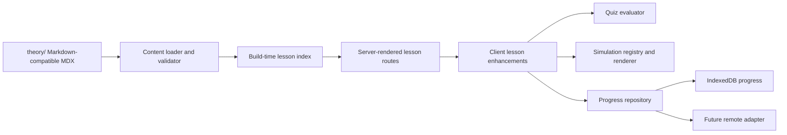

# Technical Architecture

## Purpose

This document describes the technical foundation for the System Design Visual Learning Lab. It complements the product requirements; it does not expand the V1 product into a hosted service or a general-purpose simulation platform.

The architecture is deliberately incremental:

1. Make the complete theory source useful and navigable.
2. Add local progress and quizzes behind small domain interfaces.
3. Add simulations only when real lessons require them.
4. Reuse proven primitives across lessons, tools, and design labs.

The design optimizes for conceptual correctness, direct content review, deterministic behavior, and a local-first experience.

## Architectural principles

### Theory is the source of truth

Human-authored indexed lessons live in `theory/` as Markdown-compatible MDX, as decided in ADR-001. Module overviews may remain Markdown. The application may parse frontmatter and build a content index, but it must not copy lesson prose into TypeScript page objects. A theory file should remain understandable in a repository browser or editor without the application.

Metadata identifies a lesson and its relationships. A representative shape is:

```ts
type LessonMetadata = {
  id: string;
  slug: string;
  title: string;
  description: string;
  module: string;
  difficulty: "core" | "advanced" | "deep-dive";
  estimatedMinutes: number;
  prerequisites: string[];
  tags: string[];
  visualizationId?: string;
  quizId?: string;
  relatedLessons: string[];
};
```

The exact schema can grow with the curriculum. Required fields and relationship rules belong in content validation, not in individual route components.

### Server-render static learning surfaces; keep interaction on the client

Next.js Server Components are the default for static theory content, lesson metadata, curriculum navigation, glossary data, route metadata, and build-time index work. Client Components are reserved for stateful behavior: quizzes, simulation controls and renderers, progress interactions, charts, settings, and the architecture canvas.

IndexedDB and `localStorage` are browser APIs. They must not be imported by Server Components or used as an implicit global from route loaders. The server side passes serializable lesson and simulation configuration to a client boundary; the client invokes domain services and repository adapters there.

### Local-first is a domain decision, not a UI shortcut

The learning domain must not depend on a remote API in the first version. Persistence is accessed through an interface so UI code does not know whether data is stored in IndexedDB, memory, or a future remote service:

```ts
interface ProgressRepository {
  getLessonProgress(lessonId: string): Promise<LessonProgress | null>;
  listLessonProgress(): Promise<LessonProgress[]>;
  saveLessonProgress(progress: LessonProgress): Promise<LessonProgress>;
  applyLessonMilestone(lessonId, milestone): Promise<LessonProgress>;
  getQuizAttempt(attemptId: string): Promise<QuizAttempt | null>;
  listQuizAttempts(): Promise<QuizAttempt[]>;
  saveQuizAttempt(attempt: QuizAttempt): Promise<QuizAttempt>;
  getSimulationCompletion(completionId: string): Promise<SimulationCompletion | null>;
  listSimulationCompletions(): Promise<SimulationCompletion[]>;
  saveSimulationCompletion(completion: SimulationCompletion): Promise<SimulationCompletion>;
  exportProgress(): Promise<ProgressExport>;
  importProgress(data: unknown): Promise<void>;
  resetProgress(scope: ProgressResetScope): Promise<void>;
}
```

The initial adapters are an IndexedDB-backed repository and a deterministic in-memory repository. M4 extends the shared contract with immutable quiz attempts: the caller creates one stable attempt ID per logical submission, identical re-saves are idempotent, conflicting ID reuse fails, and each retry uses a fresh ID. M5 adds immutable simulation completions identified by visualization and scenario. Saving a completion atomically advances the lesson monotonically to `visualization-complete`; only an explicitly completed engine scenario is saved. A future remote-sync adapter should satisfy the same domain behavior rather than forcing a rewrite of learning components. See ADR-003, ADR-004, and ADR-005.

### Simulations are models first and renderers second

A simulation engine should be a deterministic, testable state transition function wherever practical:

```text
initial state + action + seed
        ↓
next state + events + metrics
        ↓
client renderer and explanation panel
```

The engine owns rules, transitions, failure injection, and metrics. React Flow, SVG, Canvas, and charts own presentation only. Logical traffic must be aggregated or sampled; high-QPS scenarios must not create one DOM element per request.

### Abstractions follow evidence

M5 implements the first two simulations as real lessons and extracts only the shared controls they proved useful: play/pause/step/reset, speed, scenario presets, a bounded event timeline, metrics, failure actions, completion state, and storage feedback. It deliberately does not create a generic simulation DSL, large global store, or broad plugin system in anticipation of every future visualization.

## System shape



The index is a derived navigation artifact. It may contain parsed metadata, source paths, prerequisite edges, and references to registered quiz/simulation IDs; it does not become a second source of lesson prose.

## Responsibilities and boundaries

The intended responsibilities are:

| Area | Owns | Must not own |
| --- | --- | --- |
| `theory/` | Lesson prose, diagrams, references, quiz seeds, lesson metadata | Browser state, React imports, persistence calls |
| Content loader/index | Parsing, frontmatter validation, slugs, prerequisite graph, internal-link checks | Rendering, quiz scoring, IndexedDB details |
| `src/app/` | Routes, server/client composition, metadata, navigation | Simulation rules or direct storage mechanics |
| `src/domain/` | Lesson state, progress rules, quiz scoring, serializable contracts | React, browser APIs, vendor-specific persistence |
| `src/repositories/` | IndexedDB/in-memory adapters and import/export serialization | UI state, rendering, curriculum prose |
| `src/simulations/` | Pure engines, events, metrics, scenario definitions | DOM layout, route concerns, direct persistence |
| `src/components/` | Accessible presentation and interaction wiring | Hidden business rules duplicated from domain engines |
| `tests/` | Fixtures, contracts, unit/component/integration/e2e tests | Production behavior |

The directories may be introduced gradually. The boundary is more important than the initial number of files.

## Content pipeline

1. A contributor creates or updates a lesson under the dependency-ordered `theory/` tree.
2. Frontmatter and links are validated during the content build/check step.
3. The loader parses metadata and source content into a deterministic index.
4. Server-rendered routes use the index to resolve module and lesson navigation.
5. The lesson renderer displays the authored theory directly, except for explicitly authoring-only sections, and passes only serializable configuration to client enhancements.
6. The authoring-only `Visualization We Eventually Want` section marks the intended insertion point. It is removed from learner-facing prose; a registered visualization replaces it at that position.
7. Optional `visualizationId` and `quizId` values resolve through registries; absent registrations do not make the theory lesson unusable.

This last rule is important during the theory-first period: a lesson can ship with theory and quiz seeds before its interactive implementation exists. Keep the surrounding theory continuous and place any compact unavailable state at the relevant stage; do not expose authoring roadmap prose or interrupt the theory with a blocking warning.

### Lesson composition contract

The desktop route uses a broad two-column learning shell: curriculum navigation plus the remaining lesson canvas. Context such as prerequisites and progress belongs in the lesson header rather than a generic third rail that compresses the content. Prose keeps a readable measure while tables, diagrams, code, and simulations may use the full lesson-content width.

The visible sequence is motivation/theory → visualization → deeper analysis → practice. Stage navigation links to real semantic sections and does not imply completion. Detailed layout, ordering, responsive, availability, and review rules live in [`lesson-page-guidelines.md`](lesson-page-guidelines.md).

### Content/index invariants

- Lesson IDs and route slugs are unique.
- Prerequisite and related-lesson IDs resolve to known lessons.
- The dependency graph has no cycles unless a deliberate future model explicitly supports them.
- Internal links resolve to known files or routes; external references are kept as authored links.
- Index generation is deterministic for the same source tree.
- A metadata or registry error reports the lesson and field that caused it.

## Server/client boundary

| Server by default | Client only when interaction requires it | Boundary contract |
| --- | --- | --- |
| Theory MDX rendering | Quiz answers, scoring feedback, retry flow | Server sends lesson/question data; client returns domain events to the repository |
| Module and lesson navigation | Play/pause/step/reset and simulation controls | Server sends a `visualizationId` and serializable scenario; client loads the registered engine/renderer |
| Prerequisite graph and glossary index | Progress marks, review actions, export/import/reset | Repository calls stay behind a client-safe adapter |
| Route metadata, breadcrumbs, static references | Charts, architecture canvas, drag/connect interactions | Renderers receive model state; rules remain in domain/simulation code |
| Build-time content validation | Theme and lightweight preferences | Preferences do not become lesson-domain state |

Avoid marking a whole lesson page or layout as `"use client"` just because one tab contains a simulation. Keep the interactive portion behind a narrow client boundary and dynamically import expensive visualizations when that improves initial load.

## Local-first data model

### Progress

Progress follows the product states:

```text
Not Started → Theory Complete → Visualization Complete → Quiz Passed → Mastered
```

The domain may also record quiz attempts, incorrect concept tags, completed scenarios, review dates, and design-lab attempts. State transitions should be explicit and idempotent. A reset is an intentional operation, not an accidental consequence of a failed read or a missing browser store.

M3 persists one compact record per stable lesson ID. Absence means not started. Ordinary saves and milestone commands take the later stage, so repeated commands are idempotent and stale callers cannot regress a lesson. Curriculum summaries count theory or any later stage as theory complete; continue learning selects the first lesson in deterministic curriculum order that has not reached theory complete.

### Storage

- IndexedDB stores structured progress, attempts, review data, and design-lab state when those features exist.
- `localStorage` is reserved for small preferences such as theme or reduced-motion preference; it is not the canonical progress store.
- Store names and serialized records are versioned so migrations can be introduced before schema changes reach users.
- Exported JSON includes a schema version and enough data to restore progress without a server account.
- Import validates the envelope before writing. Invalid or unsupported exports must not partially replace existing progress.

The concrete browser database is `system-design-visual-learning-lab-progress`, database version 4. `lesson-progress` is keyed by `lessonId`, `quiz-attempts` by `attemptId`, and M5's `simulation-completions` by `completionId`. The adapter opens and closes the database lazily for each operation, never at module evaluation. Version-4 exports contain `format`, `schemaVersion`, stable-ID-sorted lessons, quiz attempts, and simulation completions. Versions 1, 2, and 3 migrate in memory with collections introduced later left empty. Import is replace-not-merge and clears plus writes all three stores in one read/write transaction after full validation. Reset targets all learning progress or selected lesson IDs and clears matching attempts and completions without touching preferences. IndexedDB request, transaction, open, migration, and availability failures surface as `ProgressStorageError` rather than empty or successful results.

No authentication, hosted database, analytics pipeline, or remote synchronization is required for the first version. These can be added as adapters and explicit product decisions later.

## Quiz and simulation separation

Quizzes and simulations are related lesson experiences but different domains.

### Quizzes

Question data is structured and addressable by lesson and concept tags. Evaluation is a pure function that returns correctness, score information, and an explanation reference or explanation text. Answer selection state belongs in the client; attempts and weak-concept signals go through the progress repository.

```ts
type QuizQuestion = {
  id: string;
  lessonId: string;
  type: "single-choice" | "multiple-choice" | "numeric-estimation";
  prompt: string;
  options?: string[];
  correctAnswer: unknown;
  explanation: string;
  conceptTags: string[];
};
```

Every question is worth one point. Single choice requires an exact option, multiple choice uses order-independent exact-set matching with no partial credit, and numeric estimates use an inclusive absolute tolerance plus a case-insensitive exact unit. Evaluation returns explanations and incorrect concept tags, and a score of at least 80% passes the shipped quizzes. During theory authoring, `Quiz Seeds` remain readable in every lesson; only selected seeds move into the separate typed registry. The seed is not a substitute for answer data and evaluation rules.

### Simulations

Each simulation has a stable ID, an engine, render configuration, scenario presets, and an explanation model. The lesson references the ID rather than importing a component from prose. A registry resolves IDs to dynamically loaded client experiences:

```text
lesson metadata: visualizationId = "consistent-hash-ring"
        ↓
visualization registry
        ↓
engine + renderer + scenario presets
```

Engines should expose enough state for a text explanation and accessible status panel. Reduced motion must not change the conceptual result of a simulation.

## Rendering strategy by visualization family

Use the simplest renderer that communicates the behavior:

- React Flow for architecture graphs, service relationships, queues, and design-lab canvases.
- SVG for hash rings, token buckets, timelines, quorum diagrams, and compact algorithmic state.
- Canvas only when many moving entities make DOM rendering impractical.
- Charts for QPS, latency percentiles, queue depth, cache hit rate, shard distribution, and error-budget burn.

All families consume the same model/event contract only after repeated implementations prove that sharing is useful.

## Routing and loading

The target route shape follows the PRD:

```text
/                 dashboard
/roadmap          dependency graph
/learn/[module]/[lesson]
/labs/[lab]
/interview
/review
/search
/settings
```

Optional standalone tools should reuse lesson visualizations rather than fork them. Static lesson metadata and content can be generated at build time. Heavy client simulation bundles should load lazily so reading a lesson does not pay for every visualization.

## Staged implementation

### Stage 0 — Content foundation (current)

Deliver:

- dependency-ordered `theory/` structure,
- authoring conventions and lesson metadata,
- deterministic content index,
- internal-link/reference validation,
- theory that remains useful without an app.

Exit when a new lesson can be added without changing navigation code and the core curriculum can be browsed as source.

### Stage 1 — Theory reader

Deliver:

- Next.js shell and server-rendered lesson routes,
- curriculum navigation, breadcrumbs, metadata, references, and previous/next links,
- MDX rendering and static diagrams,
- clear unavailable states for visualizations or quizzes not implemented yet.

Exit when theory can be read comfortably on a fresh session without client-side application state.

### Stage 2 — Local progress

Delivered in M3:

- progress domain types and transitions,
- `ProgressRepository` contract,
- in-memory and IndexedDB adapters,
- mark theory complete, continue-learning display, export/import/reset,
- persistence tests.

The learner can close and reopen the browser and retain progress without a server. The reader keeps its Server Component routes; only the overview and lesson progress controls are client boundaries.

### Stage 3 — Quiz system

Delivered in M4:

- structured question schema and registry,
- pure evaluation for initial question types,
- answer explanations, scoring, concept tags, retries, and attempt persistence,
- an end-to-end theory → quiz → progress path for one or two lessons.

The `00-03-estimation` and `04-10-consistent-hashing` lessons now complete real theory → quiz → progress slices. Quiz behavior is testable without React, and persisted failed attempts identify weak concepts without storing hidden answer keys.

### Stage 4 — First simulation experiences

Delivered in M5:

- a shared accessible simulation shell and narrow dynamically loaded client boundary,
- deterministic model/renderer separation for Horizontal Scaling and Consistent Hashing,
- scenario presets, failure injection, metrics, bounded event timelines, and reduced-motion support,
- explicit per-scenario completion persistence and a complete theory → visualization → quiz → progress slice for Consistent Hashing.

Exit when simulation state transitions are deterministic and tested, controls are keyboard accessible, reduced motion is supported, and a lesson remains understandable with the visual disabled.

### Stage 5 — Reuse and design labs

Extend the proven simulation shell, event timeline, metric panel, and scenario presets only as new topics require. Add knowledge-map connections, review mode, and the design-lab workspace in response to validated curriculum needs. Reuse registered lessons and domains; avoid a second set of rules for standalone tools or labs.

## Explicitly deferred

The following are not part of the foundation and should not shape early interfaces:

- mandatory accounts or a server database,
- remote synchronization,
- AI tutoring or grading,
- a production-accurate Raft or distributed-system implementation,
- a generic simulation language,
- all planned visualizations at once,
- vendor-specific infrastructure as the primary domain model.

If one of these becomes necessary, document the scope and trade-off in an ADR before broad implementation.

## Architecture change triggers

Create or update an ADR when a decision:

- changes the source-of-truth or content format,
- introduces a persistence or synchronization contract,
- affects multiple visualization families,
- changes Server/Client boundaries,
- adds a dependency that is difficult to replace,
- requires migration of saved learner data.

Small component choices and lesson-specific presentation details can remain in code review and do not need an ADR.
