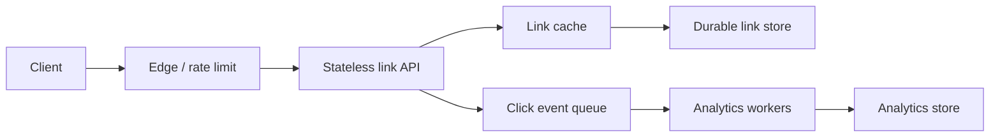

# The Interview Design Framework

> A strong system-design answer is a traceable argument: a requirement creates a pressure, the pressure motivates a design choice, and every choice comes with a cost and a failure story.

## Why This Exists

System-design prompts are intentionally underspecified. “Design a booking system” could mean a small internal tool, a global marketplace, or a flash-sale inventory service. The interviewer is not primarily looking for a memorized diagram. They are looking for evidence that you can discover the important constraints, reason about scale, communicate a coherent design, and change your mind when a constraint changes.

A common naive answer starts with a technology: “Use microservices, Redis, Kafka, and a NoSQL database.” That list has no argument behind it. It does not say which user action needs which guarantee, how much traffic the system must handle, or what happens when a dependency is slow. It also consumes valuable interview time before the scope is known.

The framework supplies a shared map for the conversation. It makes the next question visible without pretending that every interview follows a script. The useful sequence is:

```text
need → requirement → assumption/estimate → interface/data → component → risk/metric → trade-off
```

For example, “redirects must remain useful during a cache outage” may lead to a durable mapping store, a bounded database fallback, and a cache-miss metric. The store and cache are consequences of the requirement; they are not decorations added in advance.

## Mental Model

Treat the interview as a short systems-engineering review. At each stage, produce a small artifact that the interviewer can inspect:

| Question | Artifact to say or draw | Why it matters |
| --- | --- | --- |
| What must users do? | In-scope use cases and explicit exclusions | Prevents solving a different problem. |
| What does “good” mean? | Measurable NFRs and priorities | Gives architecture choices a target. |
| How much work is there? | Assumptions, peak rates, data, and headroom | Exposes likely bottlenecks before boxes appear. |
| Where does state live? | APIs, entities, access paths, ownership, and retention | Connects behavior to storage and consistency. |
| What can break? | Critical path, dependency map, failure responses, and recovery | Shows production judgment rather than only the happy path. |
| Why this design? | Decision, alternative, cost, and trigger to revisit | Makes trade-offs explicit and easy to discuss. |

Every box on the diagram should answer: **what problem caused this box to exist, and what new problem does it introduce?** A design is allowed to be simple when the requirements are simple. It is allowed to become more elaborate only when a demonstrated pressure justifies the extra complexity.

## How It Works

The following is the canonical 11-step workflow. The numbered order is a reliable default, not a one-way waterfall. Keep a visible list of assumptions and revisit an earlier step whenever a later discovery invalidates one.

| Step | Working question | Minimum useful output |
| --- | --- | --- |
| 1. Clarify requirements | Who uses the system, what actions matter, and what is out of scope? | Two to four core use cases plus exclusions. |
| 2. Identify NFRs | Which latency, availability, consistency, durability, security, geography, and cost properties matter? | Prioritized targets, not a wish list. |
| 3. Estimate scale | What are the users, request mix, peak rate, data growth, payload sizes, bandwidth, connections, and headroom? | Order-of-magnitude numbers with assumptions. |
| 4. Define APIs | What requests and responses cross the boundary, and how are retries, auth, pagination, errors, and idempotency represented? | A small contract for the critical flows. |
| 5. Model data | What entities exist, who owns them, and which access paths must be fast or atomic? | Keys, indexes, retention, consistency, and partition hints. |
| 6. Draw the high-level system | What components sit on the request path, and which work can be asynchronous? | One readable diagram with data flow and trust/failure boundaries. |
| 7. Find bottlenecks | Which resource saturates first, and where are the hot keys, fan-outs, queues, or single points of failure? | Two or three risks tied to a metric. |
| 8. Deep dive | Which risk most affects correctness or the stated target? | One sequence, invariant, capacity argument, and recovery path. |
| 9. Handle failures | What happens when instances, dependencies, networks, regions, or clients fail or overload the system? | Detection, mitigation, user-visible behavior, and data outcome. |
| 10. Discuss trade-offs | What did we improve, what did we give up, and what alternative fits another requirement? | A short decision record for the important choices. |
| 11. Summarize | Can someone repeat the requirements, design, numbers, risks, and next step? | A concise close and open follow-up questions. |

The hand-offs matter as much as the steps. A peak-QPS estimate should influence the number of workers. An API that may be retried should influence idempotency and the data model. A durability requirement should influence write acknowledgment and recovery. A failure analysis may reveal that the original “availability” target was incomplete. Say those connections aloud so the interviewer can follow the reasoning.

### A practical 45–60 minute allocation

Use this 60-minute baseline when the interviewer gives the full hour:

| Time | Focus | Output to leave visible |
| --- | --- | --- |
| 0–4 min | Clarify scope and actors | In-scope use cases and exclusions |
| 4–8 min | Identify NFRs and priorities | Latency/availability/consistency/durability targets |
| 8–13 min | Estimate scale | Average and peak rates, data, bandwidth, headroom |
| 13–18 min | Define APIs | Critical request and response shapes |
| 18–23 min | Model data | Entities, keys, indexes, ownership, retention |
| 23–30 min | Draw the high-level system | Synchronous path, asynchronous path, stateful boundaries |
| 30–34 min | Find bottlenecks | First saturation points and signals |
| 34–45 min | Deep dive | One high-risk flow, invariant, capacity, and recovery path |
| 45–52 min | Handle failures | Dependency, overload, data, and regional failure behavior |
| 52–57 min | Discuss trade-offs | Why this option, alternatives, and revisit triggers |
| 57–60 min | Summarize | Design in one minute and remaining questions |

For a 45-minute interview, compress the opening to about 10 minutes, spend roughly 15 minutes on APIs/data/high-level architecture, choose one deep dive for 9–10 minutes, and protect 5–6 minutes for failures, trade-offs, and a summary. You can combine steps 1 and 2, combine steps 4 and 5, and sketch only the critical path before expanding it.

Adapt the allocation rather than defending the clock:

- If the interviewer supplies the user journeys and scale, acknowledge those assumptions and move time to the risk they care about.
- If the interviewer asks for a deep dive early, state the missing assumptions briefly, answer the requested path, and reconnect it to the high-level design.
- If a requirement changes, pause and mark which estimates and components change. Updating the model is stronger than silently carrying stale numbers.
- If time is running out, stop adding boxes. Summarize the design, name the biggest unresolved risk, and say what you would investigate next.

The framework is a guardrail against forgetting important reasoning, not a demand to spend exactly four minutes on every box.

## Example

### Progressive worked example: a URL shortener

Suppose the prompt is: **“Design a URL-shortening service.”** Begin with a deliberately small design and let each requirement earn an improvement.

#### 1–2. Clarify the behavior and the quality bar

Ask questions that change the design:

- Must the service create a short URL and redirect a visitor, or also provide custom aliases, link editing, expiration, abuse review, and a reporting dashboard?
- Are creators authenticated? Are links private, public, or both?
- Is redirect freshness more important than reporting freshness?
- Is the first launch single-region, or must it survive a region loss?

For a first pass, assume that an authenticated creator can create a link, anyone with the code can request a redirect, links may expire, and basic click events are useful but not on the redirect’s critical path. Exclude custom domains, a full analytics UI, and abuse moderation until the interviewer asks for them.

Set illustrative NFRs: p99 redirect latency below 150 ms, p99 create latency below 500 ms, 99.95% availability for redirects, durable mapping data, and eventually consistent click counts. These are assumptions to test, not universal targets.

#### 3. Estimate the workload

Assume 20 million redirects and 1 million new links per day. That is approximately:

```text
redirect average ≈ 20,000,000 / 86,400 ≈ 230 requests/second
create average   ≈  1,000,000 / 86,400 ≈  12 writes/second
10× design peak  ≈ 2,300 redirects/second and 120 writes/second
```

If a logical link record plus indexes is roughly 1 KB, three years of one million new links per day is about 1.1 TB before replication, backups, and overhead. The useful conclusion is not “the database must be exactly 1.1 TB.” It is that redirect reads dominate, writes are comparatively modest, and retention and replicas affect storage cost. Ask whether a launch spike or global traffic needs more headroom.

#### 4. Define the critical APIs

Keep the contract small enough to reason about:

```http
POST /v1/links
Content-Type: application/json
Idempotency-Key: <client-generated-key>

{"destination":"https://example.com/a-long-path","expiresAt":"2027-01-01T00:00:00Z"}
```

The response returns the short code and URL. A repeated request with the same idempotency key should not create an accidental second link if the client retries after a timeout.

```http
GET /{code}
```

The redirect path returns the destination, or a clear `404` for an unknown code and `410` for an expired/removed link. Decide whether the redirect is temporary or permanent only after discussing destination edits and cache behavior; a permanent redirect can be cached more aggressively but makes later changes harder to observe.

#### 5. Model the data around access paths

A first record could be:

```text
Link(code primary key, destination, owner_id, created_at,
     expires_at, status, version, created_idempotency_key)
```

The redirect lookup is by `code`, so that key should be cheap to retrieve and easy to partition. The create path needs a uniqueness guarantee for `code`. Click events can be an append-only event containing `code`, timestamp, and coarse dimensions; aggregates do not need to block a redirect.

#### 6. Draw the first useful architecture



The edge and stateless API distribute traffic. The durable store is the source of truth for mappings. The cache protects the store on the read-heavy redirect path. The queue and workers keep analytics out of the redirect latency budget. On create, write the mapping durably before returning success; populate or invalidate the cache after the write is committed.

#### 7–8. Find the risk and deep dive once

At the estimated load, the first risks are cache misses, a hot code that receives a sudden burst, database connection/IO saturation, and code-generation collisions. Choose one risk based on the interviewer’s signal. A useful deep dive is code generation plus cache behavior:

- Random base62 codes make the public URL opaque. Insert with a uniqueness constraint and retry a bounded number of times on the rare collision. A central sequence is simpler to reason about but leaks volume and can become a coordination point.
- A cache hit serves a redirect quickly. A miss reads the durable store and fills the cache with an expiration policy. A cache outage must not turn into an unbounded database storm, so rate limits, bounded concurrency, and a fallback budget are part of the design.
- A popular code can become a hot key even when average QPS is small. Edge caching, replicated cache entries, or per-key request coalescing can protect the origin, but these add freshness and invalidation concerns.

#### 9. Handle failures on purpose

Ask what the user sees and what data remains correct:

| Failure | Detection signal | Immediate behavior | Remaining trade-off |
| --- | --- | --- | --- |
| Cache unavailable | Hit ratio collapses; store reads rise | Bounded fallback to the durable store; shed non-critical work | Higher latency and possible overload |
| Link store unavailable | Connection errors and p99 latency | Serve still-valid cached redirects; fail creates clearly; retry only safe/idempotent work | New links may be temporarily unavailable |
| Analytics queue backed up | Queue depth and oldest-event age | Keep redirects successful; cap producers, replay later, and isolate poison events | Counts are delayed or incomplete |
| One region lost | Health checks and regional error rate | Route reads to a prepared replica; apply the chosen create/write failover policy | Cost, RPO/RTO, and code uniqueness become harder |
| Code collision or duplicate create | Unique-key conflict and idempotency lookup | Retry collision; return the original result for a repeated idempotency key | More state and a bounded retry path |

The redirect path is more critical than click aggregation in this version. That priority justifies graceful analytics degradation; a booking or payment system would make a different choice.

#### 10–11. State the trade-offs and close

The design chooses a durable mapping store, a read cache, and asynchronous analytics because redirects are read-heavy and analytics can be delayed. It accepts cache staleness, queue lag, and operational complexity. At a small scale, one service and one relational database may be the better answer. At a global scale, read replicas or edge caching may be worth the cost, while globally unique writes and regional failover need a separate design.

Close by restating the assumptions, peak rates, critical path, first bottleneck, and unresolved decision. Invite the interviewer to choose a follow-up: global failover, hot links, code generation, abuse prevention, or analytics correctness.

### How the same method changes for a booking system

The future lab ID `13-13-ticket-and-hotel-booking` represents a different workload shape. The same 11 steps still apply, but the risk selected in step 8 changes: inventory ownership, holds, expiration, idempotent payment/order commands, and oversell prevention become more important than a cache-first redirect path. Stronger consistency on the booking write may be worth more latency and lower availability during a partition. The point is to reuse the reasoning frame, not copy the URL-shortener architecture.

## Visualization We Eventually Want

Build a future **Interview Workbench** that makes the reasoning traceable rather than grading one “correct” diagram.

1. Start with a blank 11-step timeline and a prompt card. Presets can include the future lab IDs `13-01-url-shortener` and `13-13-ticket-and-hotel-booking` without requiring local lesson links.
2. Let the learner drag time blocks between 45 and 60 minutes. A warning should appear when requirements or the closing summary consume so much time that no failure analysis remains.
3. Offer controls for request rate, read/write ratio, payload size, latency target, availability target, consistency, region count, cache hit rate, queue capacity, and dependency failure. The learner should be able to change one assumption and see which components and risks need to be revisited.
4. Reveal architecture primitives only after the learner selects a requirement or bottleneck. For example, a cache should be motivated by read pressure or latency, and a queue by a non-critical asynchronous workload.
5. Show metrics such as peak QPS, resource utilization, p50/p99 latency, cache hit rate, queue depth/age, error rate, stale responses, and data loss/RPO. A text event log should describe each simulated failure for learners who cannot rely on animation.
6. Let the learner annotate each decision with “requirement,” “assumption,” “alternative,” “cost,” and “revisit trigger.” Compare the resulting argument with a rubric for traceability, coverage, and failure reasoning rather than technology names.

The visualization needs Play, Pause, Step, Reset, speed control, keyboard-accessible controls, and reduced-motion behavior. It is a specification for a later lab, not an implementation requirement of this lesson.

## Scaling Behavior

The workflow scales by changing assumptions and workload shape, not by appending the word “distributed” to the diagram.

- At small traffic, a modular service and one durable store may satisfy the requirements. Extra replicas, caches, queues, and regions can add more failure modes than value.
- As read traffic grows, compare cache, read replicas, edge delivery, request coalescing, and a higher-capacity store. Check cache invalidation and hot-key behavior rather than assuming a cache removes all load.
- As write traffic or data volume grows, revisit partition keys, indexes, write amplification, retention, compaction, and rebalancing. A single logical entity may need an ownership or serialization strategy.
- As asynchronous work grows, estimate worker capacity, queue age, retry volume, poison messages, and replay time. Backpressure is a correctness and reliability concern, not only a performance optimization.
- As tenants or regions grow, add quotas, isolation, locality, data residency, failover, and cross-region consistency to the NFR conversation. Recalculate bandwidth, connection counts, and replication cost.

Do not use QPS as the only capacity model. Requests can have different CPU, memory, I/O, fan-out, and connection costs. Track the resource that actually saturates and leave headroom for bursts, deployments, and the failure capacity promised by the design.

## Failure Modes

Framework failures are often reasoning failures before they become infrastructure failures:

- **Scope drift:** The candidate solves an analytics dashboard when the prompt only needs a redirect. Restate in-scope and out-of-scope behavior.
- **Unmeasurable NFRs:** “Highly available” and “fast” do not select an architecture. Choose an availability window and a latency percentile, then state what is excluded.
- **Average-only capacity:** Averages hide peaks, skew, hot keys, and launch events. Estimate a peak and name the headroom assumption.
- **Unexamined critical path:** A queue, cache, or third-party call appears in the request path without a timeout, fallback, or user-visible outcome.
- **Retry amplification:** Multiple layers retry the same slow dependency and turn a small failure into overload. Set a bounded retry budget and make idempotency explicit.
- **Single-point recovery:** Replicas are drawn, but failover ownership, stale data, write conflicts, or recovery time are not described.
- **Technology substitution:** A product name stands in for partitioning, consistency, durability, or rate limiting. Explain the mechanism and guarantee first.

For any important component, ask five failure questions: **What fails? How do we detect it? What do we do immediately? What data or work may be lost or delayed? How does the system recover without making the incident worse?** This turns a component checklist into a failure argument.

## Trade-offs

The framework exposes trade-offs at two levels:

1. **Conversation trade-offs:** More time on requirements reduces time for depth; a broad diagram gives less detail per component. Choose the depth that matches the prompt and interviewer signal.
2. **Architecture trade-offs:** Stronger consistency, lower latency, higher availability, lower cost, simpler operations, and faster delivery cannot all be maximized simultaneously.

Use this sentence shape when speaking:

> “Given **requirement**, I choose **design** over **alternative** because it improves **property**. I accept **cost or limit**, and I would revisit it when **observable trigger** changes.”

For example: “Given a read-heavy redirect path with a 150 ms p99 target, I choose a cache in front of durable storage over reading the database on every request because it lowers origin load and latency. I accept staleness and cache-failure complexity, and I would revisit it when the hit rate is low or the database has spare capacity.”

## Alternatives

There is no universal “production architecture” for a prompt. Credible alternatives include:

- **Single service plus relational store:** Prefer for a small scope, modest scale, and a team that values transactional simplicity. Split services only when ownership, scaling, or isolation pressures are real.
- **Synchronous work versus a queue:** Keep work synchronous when the caller needs the result and the dependency is within the latency budget. Queue it when it is retryable, bursty, or not required for the response; then discuss delivery semantics and lag.
- **Cache versus read replica:** A cache can reduce latency and origin work but introduces freshness and invalidation concerns. A replica can preserve query semantics but still adds replication lag and read capacity cost.
- **Strong versus eventual consistency:** Use stronger coordination for uniqueness, inventory, money, or state transitions that cannot be reconciled safely. Use eventual propagation for search indexes, feeds, and analytics when a stale result is acceptable.
- **Centralized versus decentralized ID generation:** Central coordination can give simple ordering and uniqueness; partitioned or random generation can improve availability and write scale at the cost of more complex collision/order reasoning.
- **Single-region versus multi-region:** Start with one region when the recovery target permits it. Add regions when user latency, regulatory requirements, or recovery objectives justify the cost and consistency work.

## When to Use

Use the full framework for open-ended design prompts, especially when the interviewer gives only a product name or asks for a system “at scale.” It is also useful in a design review: the 11 outputs make assumptions and risks inspectable.

Use the framework in abbreviated form when the prompt is a follow-up to a previous design. For example, if the interviewer asks only how to prevent overselling, state the relevant inventory and consistency assumptions, answer that deep dive, then place it back in the larger design.

## When Not to Use

Do not recite all 11 steps when the task is a focused coding problem, a small API decision, or incident triage. In those settings, start with the observed behavior, constraints, and evidence. If the interviewer has already fixed the scope and scale, acknowledge them and spend time on the uncertainty that remains.

Do not force a long framework after the time budget is nearly gone. A clear assumption, one critical path, one failure mode, and an honest summary are more valuable than an unfinished catalogue of components.

## Common Misconceptions

- **“The 11 steps are a rigid waterfall.”** They are a checklist for coverage. Real designs loop between requirements, estimates, data, and failures.
- **“Every NFR should be maximized.”** Requirements have priorities and budgets. Improve the property that users and the business actually need.
- **“A high-level diagram is the design.”** A diagram without data flow, guarantees, capacity, and failure behavior is only a map of nouns.
- **“Exact estimates win.”** Transparent assumptions and useful orders of magnitude are more credible than unsupported precision.
- **“A cache, queue, or microservice is automatically an improvement.”** Each adds a new state, failure mode, and operating cost; introduce it only when a pressure warrants it.
- **“Failure handling means retrying.”** Timeouts, bounded retries, backoff, load shedding, idempotency, fallback behavior, and recovery are separate decisions.
- **“The summary belongs only at the end.”** Narrate the requirement-to-choice link throughout so the interviewer can redirect the discussion before time runs out.

## Interview Lens

### 30-Second Explanation

“I use an 11-step loop: clarify the core use cases, agree on prioritized non-functional requirements, estimate peak scale, define the critical APIs, model data and access paths, draw the high-level request and asynchronous paths, identify the first bottlenecks, deep dive on the highest-risk flow, handle failures and overload, compare trade-offs, and summarize. I keep assumptions visible and loop back when a new constraint changes the design. The timeline is a guardrail, so I adapt depth to the prompt and protect time for failure behavior and a close.”

### When to Introduce It

Introduce the framework immediately after the prompt, in one sentence: “I’ll start by confirming scope and success criteria, then estimate scale before drawing the critical path; I’ll reserve time for one deep dive and failures.” This gives the interviewer a chance to correct the direction and signals that the diagram will follow requirements.

### Common Follow-Ups

- Which assumption changes the design most if it is wrong?
- What saturates first at 10× the estimated peak?
- What does the client see when the primary store, cache, queue, or region fails?
- Which operations must be idempotent, and where is that guarantee enforced?
- What consistency is required for each entity, rather than for the whole system?
- Which metric would cause you to add capacity or change the architecture?
- What would you remove if the product had one-tenth of this load?

### Common Candidate Mistakes

- Drawing boxes before defining the user-visible behavior.
- Saying “millions of users” without converting it into request rates, data growth, and a peak assumption.
- Treating average latency as a guarantee and ignoring the tail.
- Adding vendor names without explaining the underlying mechanism or guarantee.
- Putting analytics, notifications, or search on the critical path without a timeout or degradation plan.
- Discussing a multi-region diagram without explaining write ownership, stale data, failover, or recovery objectives.
- Spending the last minute on another component instead of summarizing decisions and open risks.

## Summary

Remember the framework as a traceability loop:

1. Scope the user behavior before selecting technology.
2. Turn “fast,” “reliable,” and “at scale” into prioritized, measurable assumptions.
3. Estimate peak work and resource pressure before drawing the system.
4. Connect APIs and data access paths to the critical request flow.
5. Add components only when a requirement or bottleneck justifies them.
6. Deep dive on the risk that threatens correctness or the most important target.
7. Describe overload, dependency failure, recovery, and user-visible degradation.
8. State each decision’s alternative, cost, and trigger to revisit.
9. Close with the requirements, numbers, design, biggest risk, and next question.

## Quiz Seeds

1. You have 45 minutes to design a notification service. Which outputs must appear in the first 10 minutes, and which assumption would you make explicit? — Tests scope, NFR, and estimation prioritization.
2. A prompt says “global, low-latency, highly available.” What clarifying questions turn those phrases into measurable and prioritized requirements? — Tests requirement quality and conflicting goals.
3. Convert 50 million daily reads and a 10× peak factor into average and peak request rates. Which additional resource estimates could change the architecture? — Tests order-of-magnitude reasoning beyond QPS.
4. A client may retry `POST /links` after a timeout. Where would you enforce idempotency, and what data must be retained? — Tests API, data-model, and failure reasoning.
5. In the URL-shortener example, why is analytics asynchronous while the mapping write is synchronous? What requirement would reverse that choice? — Tests critical-path and consistency trade-offs.
6. The cache hit rate falls from 95% to 20% during a hot-key event. Which metrics and protections do you add before scaling the database? — Tests bottleneck diagnosis and overload control.
7. The interviewer changes a single-region requirement to “survive a region loss.” Which earlier estimates, data decisions, and failure questions must be revisited? — Tests iterative adaptation.
8. Compare a single service with one relational database to a multi-service design for a system with 100 requests per second and modest data. What pressure would justify the extra boundaries? — Tests complexity and scale trade-offs.
9. Give a one-minute summary that names the requirement, architecture choice, biggest risk, degraded behavior, and next deep dive. — Tests technical communication and closure.

## Related Topics

The prerequisite lesson IDs are `00-01-interview-signals`, `00-02-requirements`, and `00-03-estimation`. Planned applications include the future lab IDs `13-01-url-shortener` and `13-13-ticket-and-hotel-booking`; those labs are intentionally named here without local links until their lesson files are indexed.

## References

### Documentation / Articles

- [SEH 2.0: Fundamentals of Systems Engineering](https://www.nasa.gov/reference/2-0-fundamentals-of-systems-engineering/) — NASA’s systems-engineering overview grounds the habit of starting from stakeholder needs, defining boundaries and requirements, evaluating trade-offs, and applying the process iteratively.
- [AWS Well-Architected Framework](https://docs.aws.amazon.com/wellarchitected/latest/framework/welcome.html) — AWS’s framework is a useful cross-check for asking consistent questions about reliability, security, performance, cost, and operational excellence without treating one architecture as universally correct.
- [Service Level Objectives](https://sre.google/sre-book/service-level-objectives/) — Google’s SRE guidance explains how to turn user-relevant behavior into SLIs, SLOs, percentiles, and explicit expectations instead of vague “fast” or “available” claims.
- [Production Services Best Practices](https://sre.google/sre-book/service-best-practices/) — This appendix connects capacity planning to forecasts and load tests, discusses N+2-style failure headroom, and gives concrete guidance for graceful degradation, load shedding, and retry behavior.
- [Handling Overload](https://sre.google/sre-book/handling-overload/) — The chapter shows why QPS alone is a weak capacity proxy, how request cost and utilization affect overload, and why quotas, criticality, and bounded retries protect a serving system.
- [Architectural Decision Records](https://adr.github.io/) — The ADR project provides a compact communication pattern for recording a significant decision, its rationale, alternatives, trade-offs, and consequences; that is the same reasoning an interview summary should expose.
- [The C4 model for visualising software architecture](https://c4model.com/) — Simon Brown’s notation-independent hierarchy of context, containers, components, and code helps keep a system-design diagram at the level needed for the current conversation.

### Videos

- [Visualising software architecture with the C4 model](https://www.youtube.com/watch?v=x2-rSnhpw0g) — Simon Brown’s official talk adds a visual explanation of communicating architecture at multiple levels, which complements the lesson’s emphasis on readable diagrams and progressive detail.
